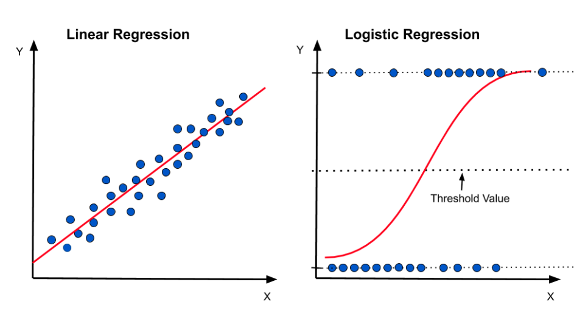
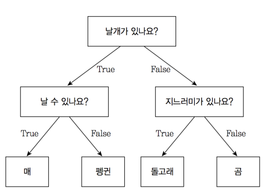
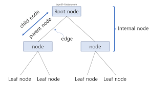
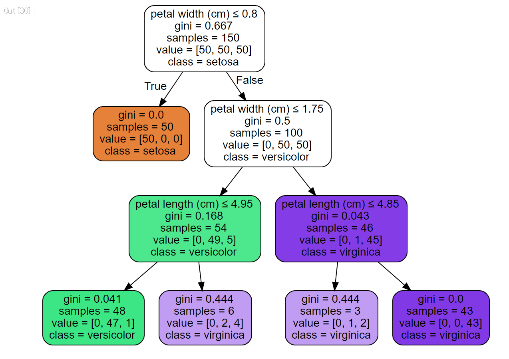

# Chapter 08. 지도학습으로 AI 모델링하기

## Section 01. 머신러닝으로 AI 모델링하기

### 1. 사이킷런 라이브러리
- **사이킷런(scikit-learn)**은 파이썬 기반의 대표적인 머신러닝 라이브러리로, 다양한 지도학습·비지도학습 알고리즘을 제공합니다.
- 데이터 전처리, 모델 학습, 예측, 평가까지 일련의 과정 지원
- 주요 모듈:
  - `sklearn.linear_model`: 선형 회귀, 로지스틱 회귀 등 선형 모델
  - `sklearn.tree`: 의사결정나무
  - `sklearn.ensemble`: 랜덤포레스트, 그래디언트 부스팅
  - `sklearn.svm`: 서포트 벡터 머신
  - `sklearn.cluster`: 클러스터링 알고리즘

1. 불러오기: `from sklearn.ensemble import RandomForestClassifier`
2. 생성: `clf = RandomForestClassifier(random_state=0)`
3. 학습: `clf.fit(X,y)`
4. 예측: `clf.predict(X)`
```python
# 사이킷런 설치
pip install scikit-learn
```

---

### 2. 선형 회귀

#### 1) 선형 회귀 이해하기
- 선형 회귀(Linear Regression)는 독립 변수(X)와 종속 변수(y) 간의 **선형 관계**를 찾아내는 지도학습 알고리즘입니다.
- 예측 값은 다음과 같이 표현됩니다.

$$
y = wX + b
$$

- `w`: 기울기(회귀계수)
- `b`: 절편
- 목표: 예측값과 실제값의 차이(오차 제곱합)를 최소화하는 `w`, `b`를 찾는 것
---

#### 2) 선형 회귀 실습하기

**예제 데이터 생성**
```python
x = []
y = []

for i in range(1, 11):
    x.append(i)
    y.append(4 * i + 7)

print("x :", x)
print("y :", y)
```

**출력**
```
x : [1, 2, 3, 4, 5, 6, 7, 8, 9, 10]
y : [11, 15, 19, 23, 27, 31, 35, 39, 43, 47]
```

**모델 생성 및 학습**
```python
from sklearn.linear_model import LinearRegression
import numpy as np

x = np.array(x).reshape(-1, 1)  # 2차원 배열로 변환

reg = LinearRegression()
reg.fit(x, y)

print("기울기 :", reg.coef_)
print("절편 :", reg.intercept_)
```

**시각화**
```python
import matplotlib.pyplot as plt

plt.scatter(x, y, color='red')                # 실제 데이터
plt.plot(x, reg.predict(x), color='blue')     # 예측 직선
plt.xlabel('X')
plt.ylabel('Y')
plt.title('선형회귀 예제')
plt.show()
```

---

#### 3) 사례 기반 선형 회귀 모델링
- 예제: 집 크기(㎡)에 따른 가격(만원) 예측
- 데이터 예시:

| 집 크기(㎡) | 가격(만원) |
|-------------|-----------|
| 30          | 2000      |
| 45          | 2700      |
| 60          | 3500      |
| 80          | 4500      |
| 100         | 6000      |

```python
import pandas as pd
from sklearn.linear_model import LinearRegression
import matplotlib.pyplot as plt

# 예제 데이터
df = pd.DataFrame({
    'size': [30, 45, 60, 80, 100],
    'price': [2000, 2700, 3500, 4500, 6000]
})

X = df[['size']]
y = df['price']

model = LinearRegression()
model.fit(X, y)

print("기울기:", model.coef_)
print("절편:", model.intercept_)
```

**시각화**
```python
plt.scatter(X, y, color='green')
plt.plot(X, model.predict(X), color='black')
plt.xlabel('집 크기 (㎡)')
plt.ylabel('가격 (만원)')
plt.title('집 크기에 따른 가격 예측')
plt.show()
```

---

### 3. 로지스틱 회귀

#### 1) 로지스틱 회귀 이해하기
- **로지스틱 회귀(Logistic Regression)**는 종속변수가 **범주형**(이진 분류, 다중 분류)일 때 사용되는 지도학습 알고리즘입니다.
- 선형 회귀와 달리 출력값을 0과 1 사이의 확률로 변환하기 위해 **시그모이드 함수**(Sigmoid Function)를 사용합니다.



시그모이드 함수:
$$
\sigma(z) = \frac{1}{1 + e^{-z}}
$$

- 출력이 0.5 이상이면 `1`, 미만이면 `0`으로 분류
- 분류 문제에서 확률 예측과 결정 경계 산출에 적합

---

#### 2) 로지스틱 회귀 실습하기 (이진 분류)

**예제 데이터 생성**
```python
import pandas as pd
import numpy as np

# 예제 데이터: 공부 시간에 따른 합격 여부 (0=불합격, 1=합격)
df = pd.DataFrame({
    'study_hours': [1, 2, 3, 4, 5, 6, 7, 8, 9, 10],
    'pass': [0, 0, 0, 0, 0, 1, 1, 1, 1, 1]
})

X = df[['study_hours']]
y = df['pass']
```

**모델 학습**
```python
from sklearn.linear_model import LogisticRegression

model = LogisticRegression()
model.fit(X, y)

print("회귀계수:", model.coef_)
print("절편:", model.intercept_)
```

**확률 예측**
```python
probs = model.predict_proba(X)
print(probs)  # [불합격 확률, 합격 확률]
```

---

#### 3) 시각화
```python
import matplotlib.pyplot as plt

# 시그모이드 함수 모양의 예측 곡선
X_range = np.linspace(0, 12, 100).reshape(-1, 1)
y_prob = model.predict_proba(X_range)[:, 1]

plt.scatter(X, y, color='red', label='실제 데이터')
plt.plot(X_range, y_prob, color='blue', label='예측 확률')
plt.xlabel('공부 시간')
plt.ylabel('합격 확률')
plt.title('로지스틱 회귀 예제')
plt.legend()
plt.show()
```

---

#### 4) 다중 분류 로지스틱 회귀 예제
```python
from sklearn.datasets import load_iris

# 아이리스 데이터셋 로드
iris = load_iris()
X = iris.data[:, :2]  # 꽃받침 길이, 폭
y = iris.target       # 품종

model = LogisticRegression(max_iter=200)
model.fit(X, y)

print("정확도:", model.score(X, y))
```

---


### 4. 의사결정나무(Decision Tree)

#### 1) 개요
- **의사결정나무**는 데이터를 여러 조건에 따라 분할하며 예측하는 **트리 구조 기반 지도학습 알고리즘**입니다.
- 분류(Classification)와 회귀(Regression) 모두 가능하지만, 주로 분류 문제에서 많이 사용됩니다.
- **루트 노드(root)**에서 시작해 조건에 따라 가지(branch)를 타고 내려가며, **리프 노드(leaf)**에서 최종 예측값을 산출합니다.




---

#### 2) 기본 원리
1. **특성 선택(feature selection)**  
   - 데이터를 가장 잘 분할하는 특성을 선택  
   - 선택 기준: **지니 불순도(Gini Impurity)**, **엔트로피(Entropy)**, **정보 이득(Information Gain)** 등
2. **데이터 분할(split)**  
   - 선택된 특성 기준으로 데이터 집합을 두 개 이상으로 나눔
3. **재귀적 분할(recursive partitioning)**  
   - 각 분할된 노드에 대해 다시 특성을 선택하고 분할을 반복
4. **종료 조건**  
   - 모든 데이터가 같은 클래스이거나  
   - 지정한 트리 깊이(`max_depth`)에 도달하면 종료

---

#### 3) 주요 용어
| 용어 | 설명 |
|------|------|
| 루트 노드 | 트리의 시작점, 전체 데이터가 포함됨 |
| 내부 노드 | 분할 조건이 있는 노드 |
| 리프 노드 | 최종 예측값을 내는 노드 |
| 깊이(depth) | 루트에서 리프까지의 최장 경로 길이 |
| 지니 불순도 | 데이터 집합의 클래스 혼합 정도를 측정 |
| 엔트로피 | 데이터의 불확실성(혼잡도) 측정 지표 |

---

#### 4) 장점
- 데이터 전처리(정규화, 스케일링)가 거의 필요 없음
- 해석이 쉬워 설명력이 높음, 결과에 대한 설명 가능
- 수치형/범주형 변수 모두 처리 가능

#### 5) 단점
- 과적합(overfitting) 가능성이 높음 → `max_depth`, `min_samples_split` 등으로 제어
- 데이터의 작은 변화에도 트리 구조가 크게 변할 수 있음(불안정성)
- 출력변수가 연속형인 회귀 모델에서는 예측력이 떨어질 수 있음

#### 6) 오버피팅 방지
- 나무의 최대 깊이(depth) 제한
- 자식 노드의 최소 샘플 수 설정
- impurity 또는 error의 최소값 설정
- 앙상블(ensemble) 알고리즘 적용

#### 7) 하이퍼파라미터 튜닝

- `max_depth` : 트리의 최대 깊이 제한
- `max_features` : 각 분할에서 고려할 최대 특징 수
- `random_state` : 재현 가능성을 위한 난수 고정

예시:

```python
from sklearn.tree import DecisionTreeClassifier

dt = DecisionTreeClassifier(
    random_state=1001,
    max_depth=5,
    max_features=3
)

dt.fit(X_train, y_train)
print("Train 정확도:", dt.score(X_train, y_train))
print("Validation 정확도:", dt.score(X_valid, y_valid))
```


#### 지니 불순도(Gini Impurity)

지니 불순도는 다음과 같이 계산됩니다.
$$
Gini = 1 - \sum_{i=1}^{n} p_i^2
$$

예시:
- 클래스 분포: [2, 4, 3]
- 총 샘플 수: 9

```python
def gini(x):
    n = x.sum()
    gini_sum = 0
    for key in x.keys():
        gini_sum += (x[key] / n) ** 2
    gini = 1 - gini_sum
    return gini
```
---

#### 예제
```python
from sklearn.tree import DecisionTreeClassifier
from sklearn.datasets import load_iris
from sklearn import tree
import matplotlib.pyplot as plt

# 데이터 로드
iris = load_iris()
X, y = iris.data, iris.target

# 모델 학습
clf = DecisionTreeClassifier(max_depth=3, random_state=42)
clf.fit(X, y)

# 시각화
plt.figure(figsize=(12,8))
tree.plot_tree(clf, feature_names=iris.feature_names, class_names=iris.target_names, filled=True)
plt.show()
```


#### 결정 트리 분류 모델 학습
```python
from sklearn.model_selection import train_test_split
from sklearn.tree import DecisionTreeClassifier

# 데이터 분할
X_train, X_valid, y_train, y_valid = train_test_split(X, y, test_size=0.2, random_state=42)

# 결정 트리 모델 생성
dt_model = DecisionTreeClassifier(random_state=1001, max_depth=2)

# 학습
dt_model.fit(X_train, y_train)

# 학습 및 검증 정확도
print("Train 정확도 =", dt_model.score(X_train, y_train))
print("Valid 정확도 =", dt_model.score(X_valid, y_valid))
```

#### 결정 트리 시각화
```python
import graphviz
from sklearn.tree import export_graphviz

# 트리 구조 시각화
tree_graph = export_graphviz(
    dt_model,
    feature_names=X.columns,
    class_names=["0", "1"],
    filled=True
)

# Graphviz 객체 생성 및 렌더
graphviz.Source(tree_graph).render("tree_depth5", format="png")
```

---

### 5. 앙상블(Ensemble) 기법 개요

#### 1. Voting
- 여러 모델의 예측 결과를 투표로 결합하는 방법
- **Hard Voting**: 최다 득표 클래스 선택
- **Soft Voting**: 각 모델의 예측 확률 평균 후, 가장 높은 확률의 클래스를 선택

#### Hard Voting 예시
```python
from sklearn.ensemble import VotingClassifier
from sklearn.linear_model import LogisticRegression
from sklearn.tree import DecisionTreeClassifier
from sklearn.svm import SVC

model1 = LogisticRegression()
model2 = DecisionTreeClassifier()
model3 = SVC(probability=True)

voting_model = VotingClassifier(
    estimators=[
        ('lr', model1),
        ('dt', model2),
        ('svc', model3)
    ],
    voting='hard'
)

voting_model.fit(X_train, y_train)
```

---

#### 2. Bagging (Bootstrap Aggregating)
- 동일한 모델을 여러 번 학습하여 예측을 결합하는 방법
- 데이터 샘플링 시 **복원 추출**(with replacement) 방식 사용
- 각 모델은 서로 다른 데이터 서브셋을 학습
- 대표적인 예: **Random Forest**

#### Bagging 주요 특징
1. **분산 감소** → 모델의 예측 안정성 향상
2. **과적합 완화** → 데이터 변동에 대한 민감도 감소
3. 개별 모델의 성능이 낮아도, 다수결로 안정적인 예측 가능

---

#### 3. Boosting
- 이전 모델이 잘못 예측한 데이터에 **가중치**를 두어 학습
- 여러 약한 학습기(Weak Learner)를 순차적으로 학습시켜 강한 학습기(Strong Learner) 생성
- 대표적인 알고리즘:
  - **AdaBoost** (Adaptive Boosting)
  - **Gradient Boosting**
  - **XGBoost**, **LightGBM**, **CatBoost**

#### Boosting 주요 특징
1. **편향(Bias) 감소**
2. 예측 정확도 향상
3. 순차적 학습으로 잘못 예측한 데이터 보완
4. 단점: 학습 속도 느리고 과적합 위험

---

#### 비교 표

| 기법 | 모델 다양성 | 학습 방식 | 장점 | 단점 | 대표 예 |
|------|------------|----------|------|------|--------|
| 보팅(Voting) | 서로 다른 모델 | 병렬 | 구현 쉬움, 다양한 모델 장점 결합 | 성능 향상 제한적 | Hard/Soft Voting |
| 배깅(Bagging) | 같은 모델 | 병렬 | 과적합 방지, 안정성 ↑ | 편향(Bias) 줄이기 어려움 | Random Forest |
| 부스팅(Boosting) | 같은 모델 | 순차 | 정확도 ↑, 편향↓ 분산↓ | 느린 학습, 과적합 위험 | AdaBoost, Gradient Boosting |

---

### 6. 랜덤 포레스트(Random Forest)

- 여러 개의 결정 트리를 학습 후 예측을 결합
- Bagging 기반 알고리즘의 대표 사례
- 하이퍼파라미터:
  - `n_estimators`: 트리 개수 (기본값 100)
  - `max_depth`: 트리 최대 깊이
  - `max_features`: 각 분할에서 고려할 최대 특성 수
  - `min_samples_split`: 노드를 분할하기 위한 최소 샘플 수

##### 예시 코드
```python
from sklearn.ensemble import RandomForestClassifier

rf = RandomForestClassifier(
    n_estimators=200,
    max_depth=10,
    random_state=1001
)

rf.fit(X_train, y_train)
print("Train 정확도:", rf.score(X_train, y_train))
print("Validation 정확도:", rf.score(X_valid, y_valid))
```

---

### 7. 그라디언트 부스팅 (Boosting)

- 이전 모델의 오차를 보완하면서 순차적으로 학습
- 약한 학습기(Weak Learner)를 강한 학습기(Strong Learner)로 만드는 방식
- 예: AdaBoost, Gradient Boosting, XGBoost, LightGBM


---

## Section 02. 딥러닝으로 AI 모델링하기

### 1. 딥러닝 개요
- **핵심 3요소**: 대규모 데이터, 연산 자원(GPU), 모델/학습 알고리즘의 발전
- **딥러닝의 장점**: 비선형 관계 학습, 자동 특성 추출, 이미지/음성/자연어 등 고차원 데이터에 강함
- **가중치(Weight)**: 입력 값이 출력에 미치는 영향의 정도를 나타내는 값.
- **편향(Bias)**: 모든 입력이 0일 때도 모델이 일정한 값을 출력할 수 있도록 하는 상수.
- 역할: 학습 과정에서 최적의 가중치와 편향을 찾는 것이 핵심.
---

### 2. 퍼셉트론과 인공신경망(ANN)

#### 1) 단일 퍼셉트론(Perceptron)
- 선형결정경계를 학습하는 가장 단순한 신경망
- 식:  
  \[
  y = \begin{cases}
  1 & \text{if } \mathbf{w}^\top \mathbf{x} + b \ge 0\\
  0 & \text{otherwise}
  \end{cases}
  \]

#### 2) 다층 퍼셉트론(MLP, ANN)
- 입력층–은닉층(1개 이상)–출력층 구조
- 은닉층에 **활성화 함수**를 적용하여 비선형성 확보

---

### 3. 활성화 함수 알아보기
활성화 함수는 **입력 신호의 총합을 출력 신호로 변환**하는 역할을 합니다.

#### (1) 시그모이드(Sigmoid)
$$
\sigma(x) = \frac{1}{1 + e^{-x}}
$$
- 출력 범위: (0, 1)
- 확률 표현에 적합하지만, **기울기 소실(Vanishing Gradient)** 문제 존재.

#### (2) 하이퍼볼릭 탄젠트(Hyperbolic Tangent, tanh)
$$
\tanh(x) = \frac{e^x - e^{-x}}{e^x + e^{-x}}
$$
- 출력 범위: (-1, 1)
- 시그모이드보다 중심이 0이라 학습 효율이 좋음.

#### (3) 렐루(ReLU)
$$
f(x) = \max(0, x)
$$
- 0 이상이면 그대로 통과, 0 이하면 0.
- 계산이 간단하고 기울기 소실 완화.
- **단점**: 뉴런이 죽는 문제(Dying ReLU).

#### (4) 리키 렐루(Leaky ReLU)
- ReLU에서 음수 영역도 작은 기울기를 부여:
$$
f(x) = \begin{cases} 
x & x \ge 0 \\ 
0.01x & x < 0 
\end{cases}
$$

#### (5) 소프트맥스(Softmax)
- 다중 클래스 분류에서 각 클래스의 확률을 출력.
$$
\text{Softmax}(z_i) = \frac{e^{z_i}}{\sum_{j} e^{z_j}}
$$


---

### 4. 심층신경망 (DNN)

#### 1) 심층신경망 구조
- 여러 개의 은닉층(Hidden Layer)을 가진 인공신경망.
- 입력층(Input) → 은닉층(Hidden) → 출력층(Output) 구성.

#### 2) 신경망 출력 계산
- 각 층의 **출력 = 활성화함수(가중치 × 입력 + 편향)**

#### 3) 손실함수
#### (1) 회귀 모델 손실함수
- **MSE (Mean Squared Error)**: 오차 제곱의 평균.
- **MAE (Mean Absolute Error)**: 절대 오차의 평균.

##### (2) 분류 모델 손실함수
- **BCE (Binary Cross-Entropy)**: 이진 분류용.
- **CCE (Categorical Cross-Entropy)**: 다중 분류용.

#### 4) 경사하강법 (Gradient Descent)
- 손실함수를 최소화하기 위해 가중치와 편향을 반복적으로 업데이트.
- 학습률(Learning Rate) 조절 중요.

---

### 5. 경사하강법과 옵티마이저
목적: 손실함수(Loss Function)를 최소화하는 최적의 매개변수(가중치, 편향)를 찾기.
아이디어: 손실함수의 기울기(Gradient)를 계산하고, 기울기가 낮아지는 방향으로 조금씩 이동.


#### 1) 경사하강법 종류
- **Batch Gradient Descent (배치 경사하강법)**  
  - 모든 데이터를 사용해 한 번에 기울기 계산 후 매개변수 갱신  
  - 장점: 수렴이 안정적  
  - 단점: 데이터셋이 클 경우 계산량이 많아 느림  

- **Stochastic Gradient Descent (확률적 경사하강법, SGD)**  
  - 데이터 샘플 1개마다 매개변수 갱신  
  - 장점: 빠르게 업데이트 가능, 국소 최소값 탈출 가능성↑  
  - 단점: 진동이 심해 최적화 경로가 불안정  

- **Mini-batch Gradient Descent (미니배치 경사하강법)**  
  - 데이터를 소규모 배치(batch) 단위로 나누어 업데이트  
  - 장점: 연산 효율성과 안정성의 균형  
  - 딥러닝에서 가장 일반적으로 사용되는 방식

---

### 2) 대표 옵티마이저(Optimizer)
- **SGD + Momentum**  
  - 기존 SGD에 관성을 부여해 진동을 완화하고 수렴 속도 향상  
  - 관성(Momentum) → 이전 기울기 방향을 일정 비율 유지  

- **AdaGrad**  
  - 매개변수별로 다른 학습률을 적용  
  - 희소(sparse) 특성에 유리하지만, 학습률이 점점 작아지는 단점  

- **RMSProp**  
  - 기울기의 제곱에 대한 지수이동평균을 적용해 학습률 폭주 방지  
  - 순환신경망(RNN) 학습에 자주 사용  

- **Adam (Adaptive Moment Estimation)**  
  - 모멘텀 + RMSProp을 결합  
  - 대부분의 딥러닝 모델에서 기본값처럼 사용됨

---

### 6. TensorFlow/Keras 준비
#### 1) 텐서(Tensor)
- 다차원 배열 구조.
- 예: 스칼라(0D), 벡터(1D), 행렬(2D), 고차원 텐서(3D 이상).

#### 2) 주요 딥러닝 프레임워크
- **TensorFlow**: 구글 개발, 배포 친화적.
- **Keras**: 직관적 API, TensorFlow와 통합.
- **PyTorch**: 연구·논문 구현 강세, 동적 계산 그래프.

#### 3) 텐서플로 설치 및 활용
```bash
pip install tensorflow

import tensorflow as tf
from tensorflow import keras
from tensorflow.keras import layers
print(tf.__version__)
```

### 7. 첫 분류 모델(Sequential) 만들기 예제

```python
import numpy as np
from tensorflow.keras import Sequential
from tensorflow.keras.layers import Dense
from tensorflow.keras.utils import to_categorical
from sklearn.model_selection import train_test_split

# (예시) X: 특성, y: 정수 라벨(0~K-1)
# X.shape = (N, d)

# 더미 데이터 예시
N, d, K = 1000, 20, 3
X = np.random.randn(N, d).astype("float32")
y = np.random.randint(0, K, size=(N,))
y_onehot = to_categorical(y, num_classes=K)

X_train, X_test, y_train, y_test = train_test_split(
    X, y_onehot, test_size=0.2, random_state=42
)

model = Sequential([
    Dense(64, activation='relu', input_shape=(d,)),
    Dense(32, activation='relu'),
    Dense(K, activation='softmax')
])

model.compile(
    optimizer='adam',
    loss='categorical_crossentropy',
    metrics=['accuracy']
)

hist = model.fit(
    X_train, y_train,
    epochs=20,
    batch_size=32,
    validation_split=0.2,
    verbose=0
)

test_loss, test_acc = model.evaluate(X_test, y_test, verbose=0)
print("Test Acc:", round(test_acc, 4))

```

### 8. 과적합 방지 팁
- EarlyStopping: 검증 성능이 더 이상 좋아지지 않으면 학습 중단.
- Dropout: 학습 중 일부 뉴런을 랜덤으로 꺼서(출력 0) 특정 경로 의존 방지.
- L2 정규화: 가중치가 너무 커지지 않도록 제약을 걸어 단순한 모델 유지.
**원리**: 큰 가중치는 모델이 훈련 데이터에 지나치게 맞춰질 위험이 있음 → 가중치 크기를 줄여 단순한 모델 유도.
- Batch Normalization: 각 미니배치마다 특성값의 분포를 표준화(평균=0, 표준편차=1) 하는 층을 추가하는 방법.
- 데이터 증강(Data Augmentation): 데이터 변형(회전, 확대, 잡음 추가 등)으로 양과 다양성 증가.

```python

from tensorflow.keras.callbacks import EarlyStopping
from tensorflow.keras.layers import Dropout, BatchNormalization

model = Sequential([
    Dense(128, activation='relu', input_shape=(d,),
          kernel_regularizer=regularizers.l2(0.001)), #팁3
    BatchNormalization(), #팁4
    Dropout(0.3), #팁2
    Dense(64, activation='relu',
          kernel_regularizer=regularizers.l2(0.001)),
    Dropout(0.3),
    Dense(K, activation='softmax')
])

model.compile(optimizer='adam', loss='categorical_crossentropy', metrics=['accuracy'])
es = EarlyStopping(monitor='val_loss', patience=5, restore_best_weights=True) # 팁1
model.fit(X_train, y_train, epochs=50, batch_size=32, validation_split=0.2, callbacks=[es], verbose=0)
```