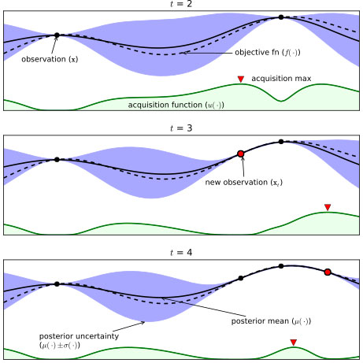

# Chapter 10. 모델 성능 향상하기

## Section 01. 모델 하이퍼파라미터 튜닝 이해하기

### 1. 그리드 서치 (Grid Search)
#### 1) 그리드 서치 이해하기
- **정의**: 사용자가 지정한 하이퍼파라미터 **모든 조합**을 대상으로 교차검증을 수행해 최적값을 찾는 방법.
- **장점**: 탐색 결과가 **결정적(deterministic)**이며, 전체 공간을 촘촘히 확인.
- **단점**: 조합 수가 많아질수록 **계산량 폭증(조합 폭발)**, 연속형 범위 탐색에 비효율.

#### 2) 그리드 서치 실습하기
```python
from sklearn.ensemble import RandomForestRegressor
from sklearn.model_selection import GridSearchCV, KFold

rf = RandomForestRegressor(random_state=42)

param_grid = {
    "n_estimators": [100, 300, 500],
    "max_depth": [None, 10, 20],
    "min_samples_split": [2, 5, 10],
    "min_samples_leaf": [1, 2, 4],
    "max_features": ["auto", "sqrt"]
}

cv = KFold(n_splits=5, shuffle=True, random_state=42)

grid = GridSearchCV(
    estimator=rf,
    param_grid=param_grid,
    scoring="neg_root_mean_squared_error",  # RMSE 최소화
    cv=cv,
    n_jobs=-1,
    verbose=1
)
grid.fit(X_train, y_train)

print("Best Params:", grid.best_params_)
print("Best CV RMSE:", -grid.best_score_)
best_rf = grid.best_estimator_
```

### 2. 랜덤 서치 (Random Search)
#### 1) 랜덤 서치 이해하기
정의: 하이퍼파라미터 공간을 무작위 샘플링으로 탐색.

장점: 그리드 대비 적은 계산량으로 더 넓은 공간 탐색, 연속형/넓은 범위에 유리.

단점: 탐색 결과가 샘플링 운에 영향. (시드 고정으로 재현성 확보 가능)

#### 2) 랜덤 서치 실습하기

```python
from sklearn.model_selection import RandomizedSearchCV
from scipy.stats import randint, uniform

rf = RandomForestRegressor(random_state=42)

param_dist = {
    "n_estimators": randint(100, 800),
    "max_depth": [None] + list(range(5, 31, 5)),
    "min_samples_split": randint(2, 20),
    "min_samples_leaf": randint(1, 10),
    "max_features": ["auto", "sqrt", "log2"]
}

rand = RandomizedSearchCV(
    estimator=rf,
    param_distributions=param_dist,
    n_iter=40,                     # 시도 횟수
    scoring="neg_mean_absolute_error",
    cv=5,
    random_state=42,
    n_jobs=-1,
    verbose=1
)
rand.fit(X_train, y_train)

print("Best Params:", rand.best_params_)
print("Best CV MAE:", -rand.best_score_)
best_rf_rand = rand.best_estimator_
```
---
### Grid search vs Random search
```python
# grid search
파라미터 후보 예:
learning_rate = [0.01, 0.1, 1.0]
max_depth = [3, 5, 7]

→ 3 × 3 = 9개의 모든 조합 시도

# random search
위 범위나 분포에서 랜덤하게 일부 조합만 시도
예: (0.1, 5), (1.0, 3), (0.01, 7) ...
→ 탐색 횟수는 사용자가 지정 (예: 20회)
```
### 3. Bayesian Optimization

# 베이지안 최적화 (Bayesian Optimization)

베이지안 최적화는 **최적의 하이퍼파라미터를 효율적으로 찾기 위한 확률 기반 최적화 기법**입니다.  
Grid Search나 Random Search보다 **적은 시도로** 좋은 값을 찾을 가능성이 높습니다.


## 1. 핵심 아이디어
- 이전 시도의 결과를 이용해, **다음 시도할 후보를 똑똑하게 선택**
- 현재까지의 탐색 결과로 **확률 모델(Surrogate Model)**을 업데이트
- 모델 예측을 바탕으로 **다음 탐색 위치**를 정하는 전략




## 2. 동작 과정
1. **탐색할 파라미터 공간 정의**  
   예: `learning_rate ∈ [0.001, 0.1]`, `max_depth ∈ [3, 10]`
2. **초기 샘플 선택 & 평가**  
   보통 랜덤하게 몇 개 시도
3. **확률 모델 학습**  
   - 주로 **가우시안 프로세스(Gaussian Process, GP)** 사용
   - 파라미터 조합 → 성능 점수 관계를 추정
   - 각 조합 → 성능 점수(예: 정확도) 데이터를 GP로 학습.
   - GP는 각 지점의 **평균 예측값(μ)**과 **불확실성(σ)**을 추정.
4. **획득 함수(Acquisition Function)**로 다음 후보 결정 
   - μ와 σ를 활용해 "다음 평가할 지점"을 선택.
   - 예: Expected Improvement(EI), Upper Confidence Bound(UCB)
   - **탐험**(Exploration)과 **활용**(Exploitation) 균형 조정
   - 선택한 지점을 실제로 학습·평가 → GP에 다시 반영.
5. **후보 실행 → 결과 반영 → 모델 업데이트**  
   위 과정을 반복

## 3. 장점
- 적은 시도로도 최적값 근처를 빠르게 탐색
- 평가 비용이 큰 문제(예: 딥러닝 모델 학습)에 효율적
- Grid/Random Search 대비 자원 절약


## 4. 단점
- 고차원 파라미터 공간(20차원 이상)에서 성능 저하
- 구현 복잡
- 초반에 지역 최적해(Local Optimum)에 빠질 수 있음


## 5. 비유
- **Random Search**: 맛집 지도를 아무 데나 찍고 가본다
- **Grid Search**: 지도를 일정한 격자로 나누어 전부 가본다
- **베이지안 최적화**: 지금까지 가본 집 중 맛있었던 곳 근처를 더 가되, 가끔 안 가본 동네도 시도한다


## 6. 활용 라이브러리
- `scikit-optimize (skopt)`
- `hyperopt`
- `optuna`

---


## Section 02. 머신러닝 모델링 및 하이퍼파라미터 튜닝 실습하기
- 목표: 항공권 가격(연속값) 회귀 문제.
- 지표 권장: RMSE, MAE, R².

### 1. [회귀] 항공권 가격 예측 모델링하기

#### 1) 데이터 불러오기

```python
import pandas as pd

df = pd.read_csv("airfare.csv", encoding="utf-8")  # 파일명/경로는 실제에 맞게 수정
print(df.shape, df.head(2))
```

### 2) 데이터 전처리하기
#### (1) Unnamed 삭제 및 데이터 기초 통계 정보 확인하기

```python
# 'Unnamed'로 시작하는 보조 인덱스 컬럼 제거
df = df.loc[:, ~df.columns.str.startswith("Unnamed")]
# 공백/대소문자 정리
df.columns = df.columns.str.strip()
print(df.info())
print(df.describe(include="all").T)
```
#### (2) Null 데이터 분석 및 처리하기
```python
nulls = df.isnull().sum().sort_values(ascending=False)
print(nulls)

# 예시: 수치형은 중앙값, 범주형은 'Unknown'으로 대체
num_cols = df.select_dtypes(include="number").columns
cat_cols = df.select_dtypes(exclude="number").columns

df[num_cols] = df[num_cols].fillna(df[num_cols].median())
df[cat_cols] = df[cat_cols].fillna("Unknown")
```

#### (3) airline 칼럼 분석 및 처리하기

범주 수가 많다면 상위 Top-K만 유지, 나머지는 "Other"로 통합.
```python
topk = 10
air_counts = df["airline"].value_counts()
major = air_counts.index[:topk]
df["airline"] = df["airline"].where(df["airline"].isin(major), "Other")
```
#### (4) flight 칼럼 분석 및 처리하기

예: 항공편 코드에서 알파벳(항공사 코드), 숫자(편명) 분리.

```python
import numpy as np

df["flight_prefix"] = df["flight"].astype(str).str.extract(r"([A-Za-z]+)")
df["flight_num"]    = df["flight"].astype(str).str.extract(r"(\d+)").astype(float)
df["flight_prefix"] = df["flight_prefix"].fillna("Unknown")
df["flight_num"]    = df["flight_num"].fillna(df["flight_num"].median())
# 원본 칼럼은 보관/삭제 선택
df = df.drop(columns=["flight"])
```
#### (5) 원핫 인코딩하기

```python
from sklearn.model_selection import train_test_split

target = "price"  # 종속변수명 가정, 실제 칼럼명에 맞게 수정
features = [c for c in df.columns if c != target]

X = df[features].copy()
y = df[target].copy()

# 범주형/수치형 분리 후 원핫
cat_cols = X.select_dtypes(exclude="number").columns
X = pd.get_dummies(X, columns=cat_cols, drop_first=True)
```
#### (6) 학습 데이터 만들기

```python
X_train, X_test, y_train, y_test = train_test_split(
    X, y, test_size=0.2, random_state=42
)
print(X_train.shape, X_test.shape)
```

### 3) 모델 학습하기
#### (1) 머신러닝 라이브러리 불러오기

```python
from sklearn.linear_model import LinearRegression, Ridge, Lasso
from sklearn.ensemble import RandomForestRegressor, GradientBoostingRegressor
from sklearn.metrics import mean_absolute_error, mean_squared_error, r2_score
import numpy as np
import pandas as pd
```
#### (2) 머신러닝 모델 생성하기

```python
models = {
    "LinearRegression": LinearRegression(),
    "Ridge": Ridge(alpha=1.0, random_state=42),
    "Lasso": Lasso(alpha=0.001, random_state=42, max_iter=10000),
    "RandomForest": RandomForestRegressor(n_estimators=300, random_state=42),
    "GradientBoosting": GradientBoostingRegressor(random_state=42)
}
```
#### (3) 머신러닝 모델 학습하기 & (4) 머신러닝 모델 성능 비교하기

```python
def eval_reg(y_true, y_pred):
    mae  = mean_absolute_error(y_true, y_pred)
    rmse = mean_squared_error(y_true, y_pred, squared=False)
    r2   = r2_score(y_true, y_pred)
    return mae, rmse, r2

rows = []
for name, model in models.items():
    model.fit(X_train, y_train)
    pred = model.predict(X_test)
    mae, rmse, r2 = eval_reg(y_test, pred)
    rows.append([name, mae, rmse, r2])

report = pd.DataFrame(rows, columns=["Model", "MAE", "RMSE", "R2"]).sort_values("RMSE")
print(report)
```
#### (선택) 파이프라인 + 교차검증 + 튜닝 통합 예시
범주형/수치형 전처리부터 모델, 그리고 튜닝까지 한 번에

```python
from sklearn.compose import ColumnTransformer
from sklearn.preprocessing import OneHotEncoder, StandardScaler
from sklearn.pipeline import Pipeline
from sklearn.model_selection import GridSearchCV

# 원본 df에서 분리 (파이프라인에 전처리를 맡기는 버전)
y = df[target]
X = df.drop(columns=[target])

num_cols = X.select_dtypes(include="number").columns
cat_cols = X.select_dtypes(exclude="number").columns

preprocess = ColumnTransformer(
    transformers=[
        ("num", StandardScaler(), num_cols),
        ("cat", OneHotEncoder(handle_unknown="ignore"), cat_cols)
    ]
)

pipe = Pipeline(steps=[
    ("prep", preprocess),
    ("model", RandomForestRegressor(random_state=42))
])

param_grid = {
    "model__n_estimators": [200, 400],
    "model__max_depth": [None, 15, 25],
    "model__min_samples_leaf": [1, 3, 5]
}

grid = GridSearchCV(
    pipe,
    param_grid=param_grid,
    cv=5,
    n_jobs=-1,
    scoring="neg_root_mean_squared_error"
)
grid.fit(X, y)

print("Best Params:", grid.best_params_)
print("Best RMSE:", -grid.best_score_)
best_pipe = grid.best_estimator_
```