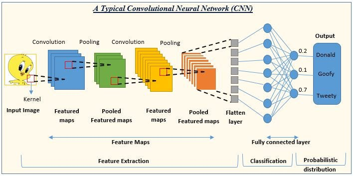

# RNN, LSTM, CNN 개념 정리

## 1. RNN (Recurrent Neural Network)
- **개념**: 순환 신경망. 시퀀스(Sequence) 데이터 처리에 특화된 신경망 구조로, 이전 시점의 출력을 다음 시점의 입력으로 전달하여 **시간적 의존성**을 학습.

- **특징**:
  - 시계열 데이터, 자연어 처리(NLP), 음성 인식 등에 적합.
  - 은닉 상태(hidden state)를 이용하여 이전 정보를 기억.
  - 장기 의존성(long-term dependency) 문제 발생 가능 → **Vanishing Gradient** 문제.

- **수식**:
  \[
  h_t = f(W_h h_{t-1} + W_x x_t + b)
  \]
  - \( h_t \): 현재 시점의 은닉 상태
  - \( x_t \): 현재 입력
  - \( W_h, W_x \): 가중치
  - \( f \): 비선형 활성화 함수 (tanh, ReLU 등)

---

## 2. LSTM (Long Short-Term Memory)
- **개념**: RNN의 장기 의존성 문제를 해결하기 위해 제안된 구조.
- **핵심 아이디어**: **Cell State**를 통해 중요한 정보는 오래 유지하고, 필요 없는 정보는 게이트(Gate)로 제거.

- **구성 요소**:
  1. **Forget Gate**: 불필요한 정보 제거.
  2. **Input Gate**: 새로운 정보 저장 여부 결정.
  3. **Output Gate**: 다음 시점에 전달할 출력 결정.

- **수식**:
  1. Forget Gate:
     \[
     f_t = \sigma(W_f [h_{t-1}, x_t] + b_f)
     \]
  2. Input Gate & 후보 값:
     \[
     i_t = \sigma(W_i [h_{t-1}, x_t] + b_i)
     \]
     \[
     \tilde{C}_t = \tanh(W_C [h_{t-1}, x_t] + b_C)
     \]
  3. Cell State 업데이트:
     \[
     C_t = f_t * C_{t-1} + i_t * \tilde{C}_t
     \]
  4. Output Gate:
     \[
     o_t = \sigma(W_o [h_{t-1}, x_t] + b_o)
     \]
     \[
     h_t = o_t * \tanh(C_t)
     \]

- **장점**:
  - 장기 의존성 학습 가능.
  - 텍스트 번역, 음성 합성 등에서 성능 우수.

---

## 3. CNN (Convolutional Neural Network)
- **개념**: 합성곱 연산(Convolution)을 사용하여 특징을 추출하는 신경망.

- **주요 활용 분야**: 이미지 인식, 영상 분석, 음성 처리.
- **구조 요소**:
  1. **Convolution Layer**: 필터(커널)를 통해 특징 맵 생성.
  2. **Pooling Layer**: 다운샘플링으로 연산량 감소 및 특징 요약.
  3. **Fully Connected Layer**: 최종 분류나 회귀를 수행.

- **수식** (1D Convolution 예시):
  \[
  y_j = \sum_{i=0}^{k-1} w_i \cdot x_{j+i} + b
  \]
  - \( w_i \): 필터 가중치
  - \( x_{j+i} \): 입력 데이터
  - \( k \): 필터 크기

- **특징**:
  - 지역적인 패턴 감지에 강함.
  - 가중치 공유로 파라미터 수 감소.
  - 계층이 깊어질수록 추상적 특징 학습 가능.

---

## 4. 비교 표

| 구분     | RNN | LSTM | CNN |
|----------|-----|------|-----|
| 주요 목적 | 시퀀스 처리 | 장기 의존성 시퀀스 처리 | 이미지·공간 패턴 처리 |
| 구조 특징 | 순환 연결 | 게이트 + 셀 상태 | 합성곱·풀링 |
| 장점 | 간단한 구조 | 장기 의존성 처리 | 지역 패턴 학습, 효율성 |
| 단점 | 장기 의존성 학습 어려움 | 구조 복잡, 연산량 큼 | 시퀀스 처리에 한계 |

---