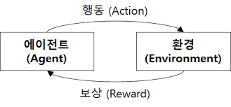

# 강화학습(Reinforcement Learning) & 전이학습(Transfer Learning)

## 1. 강화학습 (Reinforcement Learning, RL)

### 개념
- **행동(Policy)**을 통해 환경(Environment)과 상호작용하면서 **보상(Reward)**을 최대화하는 학습 방식.
- 지도학습(supervised)처럼 정답 라벨이 주어지지 않고, 비지도학습(unsupervised)처럼 단순 패턴 발견이 아닌 **목표 지향적** 학습.
- 에이전트(Agent)가 시도-실패를 반복하며 최적 정책을 학습.

### 주요 구성 요소
1. **Agent**: 행동을 선택하는 주체.
2. **Environment**: Agent가 상호작용하는 세계.
3. **State (S)**: 현재 환경 상태.
4. **Action (A)**: Agent가 취할 수 있는 행동.
5. **Reward (R)**: 행동 후 환경이 주는 점수.
6. **Policy (π)**: 상태에서 행동을 선택하는 전략.
7. **Value Function (V, Q)**: 미래 보상 기대값.

### 핵심 아이디어
- **Trial & Error** 기반.
- 목표: 누적 보상(`Return`) 최대화.
- 예시: AlphaGo(바둑), 자율주행, 로봇 제어.

### 수식 예시 (Q-learning)
\[
Q(s,a) \leftarrow Q(s,a) + \alpha \big[ r + \gamma \max_{a'} Q(s',a') - Q(s,a) \big]
\]
- \( \alpha \): 학습률
- \( \gamma \): 미래 보상 할인율

---

## 2. 전이학습 (Transfer Learning)

### 개념
- **이미 학습된 모델의 지식**을 새로운 과제에 활용하는 학습 방법.
- 데이터 부족 문제 해결, 학습 시간 단축, 성능 향상에 유리.
- 특히 딥러닝에서 대규모 데이터로 학습된 **사전학습 모델(Pre-trained Model)**을 활용.

### 절차
1. **사전 학습 (Pre-training)**:
   - 대규모 일반 데이터셋에서 모델 학습 (예: ImageNet, GPT 사전학습).
2. **미세 조정 (Fine-tuning)**:
   - 목표 과제 데이터에 맞춰 일부 레이어만 재학습 or 전체 가중치 조정.

### 종류
1. **Feature Extraction**:
   - 학습된 모델의 하위 계층(특징 추출기)만 사용.
2. **Fine-tuning**:
   - 사전학습 가중치를 초기값으로 사용하고 전체 또는 일부 레이어 재학습.

### 장점
- 데이터와 자원 절약.
- 빠른 수렴.
- 소규모 데이터셋에서 좋은 성능.

---

## 3. 비교 표

| 구분        | 강화학습(RL)                       | 전이학습(Transfer Learning)             |
|-------------|------------------------------------|------------------------------------------|
| 학습 방식   | 보상 기반 시도-오류                 | 기존 모델 지식 재활용                   |
| 데이터 필요 | 환경 상호작용으로 생성 가능         | 사전 학습 데이터 + 소량의 목적 데이터   |
| 주요 목표   | 최적 행동 전략 학습                 | 빠른 학습, 소규모 데이터에서 성능 확보  |
| 대표 사례   | AlphaGo, 로봇 제어, 게임 AI         | BERT Fine-tuning, ResNet Feature Extract |

---
